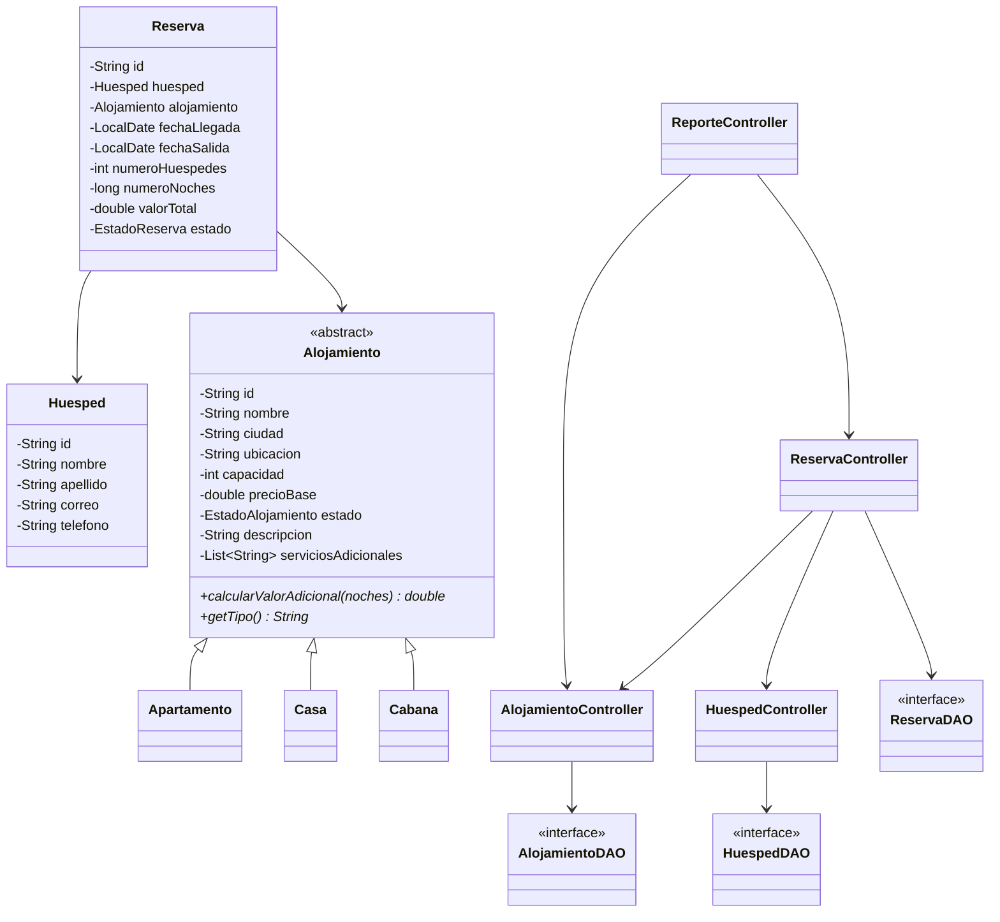

# Sistema de Gestión de Alojamientos — Inversiones LR

Proyecto para **Desarrollo de Sistemas de Información 2** (Universidad El Bosque).
Aplicación de consola en Java que administra alojamientos, huéspedes y reservas,
persistiendo la información en archivos planos mediante el patrón **DAO + DTO + DataMapper**,
con lógica de negocio organizada en **MVC**.

## Cómo importarlo en Eclipse

1. Abre Eclipse → `File > Import > Existing Projects into Workspace` (o `General > Projects from Folder or Archive`).
2. Selecciona la carpeta `GestionAlojamientos` (o el .zip directamente).
3. Verifica que la carpeta `src` quede marcada como *Source Folder*.
4. Ejecuta `Main.java` como Java Application.
5. La carpeta `data/` se crea automáticamente la primera vez que se guarda algo;
   si no existe todavía, el programa simplemente inicia sin datos previos
   (no se cae, según lo pedido en el numeral 7 del enunciado).

## Estructura de paquetes (MVC + DAO + DTO + DataMapper)

```
co.edu.unbosque
 ├── Main.java                  (arranque de la aplicación)
 ├── model/                     Entidades de dominio (POO: herencia/polimorfismo)
 │    ├── Alojamiento (abstracta) → Apartamento, Casa, Cabaña
 │    ├── Huesped
 │    ├── Reserva
 │    └── EstadoAlojamiento / EstadoReserva (enums)
 ├── dto/                       Objetos planos para transportar datos
 ├── mapper/                    DataMapper: Entity <-> DTO <-> línea de archivo
 ├── persistence/               Interfaces DAO
 │    └── impl/                 Implementación sobre archivos planos
 ├── controller/                Reglas de negocio (capa "Controller" del MVC)
 │    ├── AlojamientoController
 │    ├── HuespedController
 │    ├── ReservaController
 │    └── ReporteController
 ├── view/
 │    └── MenuPrincipal          Menú de consola (capa "View")
 └── exception/                 Excepciones de negocio y de persistencia
```

### Por qué esta separación

- **model**: solo conoce reglas propias del dominio (p. ej. cada tipo de alojamiento
  sabe calcular su propio cargo adicional — `calcularValorAdicional`). No sabe nada
  de archivos ni de consola: ahí está la **Abstracción/Encapsulación**.
- **dto**: no tiene comportamiento, solo campos planos (String/número). Es lo que
  viaja hacia/desde el archivo.
- **mapper (DataMapper)**: traduce en ambos sentidos: `Entity ↔ DTO` y `DTO ↔ línea de texto`.
  Es el único lugar que conoce el formato del archivo plano (`campo1|campo2|...`).
- **persistence (DAO)**: solo sabe leer/escribir archivos de DTOs; no conoce reglas de negocio.
- **controller**: valida reglas de negocio (identificadores únicos, capacidad,
  fechas, estados) y orquesta DAO + Mapper + Model.
- **view**: solo interactúa con el usuario por consola y delega todo al controller.

## Diagrama de clases (resumen)



*(Puedes pegar este bloque en https://mermaid.live para exportarlo como imagen
y anexarlo al entregable de "Diagrama de clases").*

## Reglas de negocio implementadas

- Identificadores únicos para alojamiento, huésped y reserva.
- Capacidad y precio por noche > 0.
- Fecha de salida posterior a la de llegada.
- Número de huéspedes > 0 y no mayor a la capacidad del alojamiento.
- No se puede reservar un alojamiento `INACTIVO`.
- Cálculo del valor: `noches × precioBase + calcularValorAdicional(noches)`,
  donde cada subtipo define su propio adicional (Apartamento: $0,
  Casa: tarifa fija de aseo, Cabaña: 10% de servicio sobre el valor base).
  Estos valores son un punto de partida: se pueden ajustar libremente.
- Cancelar una reserva ya `CANCELADA` lanza una excepción de negocio; el
  registro nunca se borra, solo cambia de estado.

## Reportes incluidos (se piden mínimo 2)

1. Alojamientos registrados por ciudad
2. Alojamientos disponibles (ACTIVOS) por tipo
3. Cantidad de alojamientos por tipo
4. Total de reservas confirmadas
5. Total de reservas canceladas
6. Ingresos estimados de reservas confirmadas
7. Alojamiento con mayor número de reservas

## Manejo de excepciones

Se crearon excepciones específicas (`ArchivoInexistenteException`,
`ArchivoVacioException`, `RegistroFormatoIncorrectoException`,
`IdentificadorInexistenteException`, `IdentificadorDuplicadoException`,
`EntradaInvalidaException`, `FechaInvalidaException`,
`DatoObligatorioVacioException`, `ReglaDeNegocioException`) para que cada
error se pueda explicar con claridad en la sustentación. El menú captura
cualquier excepción y sigue funcionando (no se cae ante una entrada mal hecha).

## Lo que falta para el entregable completo (no es código)

El enunciado también pide, además de la app funcional y el código:
- **Acta de constitución del proyecto**
- **Matriz de requerimientos**
- **Diagrama de clases** (ya tienes el Mermaid de arriba como base)

Puedo ayudarte a redactar esos documentos (Word) cuando quieras — dime y
seguimos con eso.

## Posibles extensiones para sustentar mejor

- Agregar una segunda validación de negocio propia del equipo (p. ej. no permitir
  dos reservas confirmadas con fechas cruzadas para el mismo alojamiento).
- Añadir un tipo adicional de alojamiento (p. ej. `Hostal`) para mostrar que el
  diseño es extensible sin tocar el resto del sistema (principio abierto/cerrado).
- Cambiar el separador de campos o el formato de archivo, mostrando que el
  cambio queda aislado en el `DataMapper` correspondiente.
